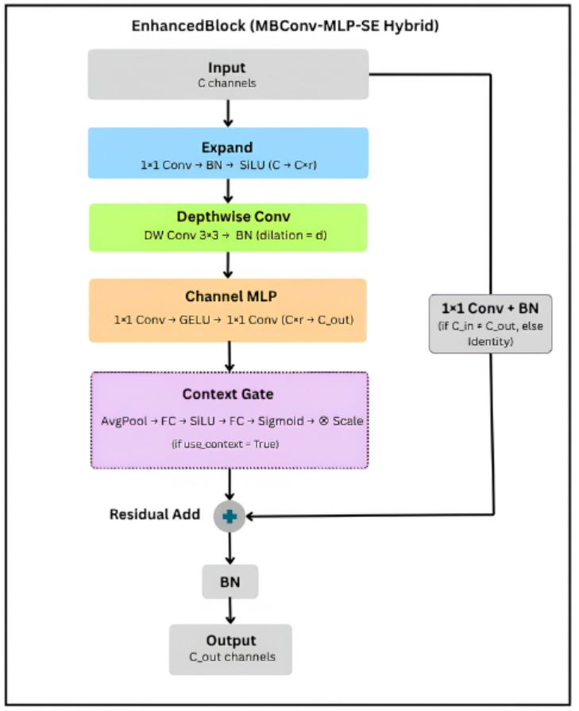
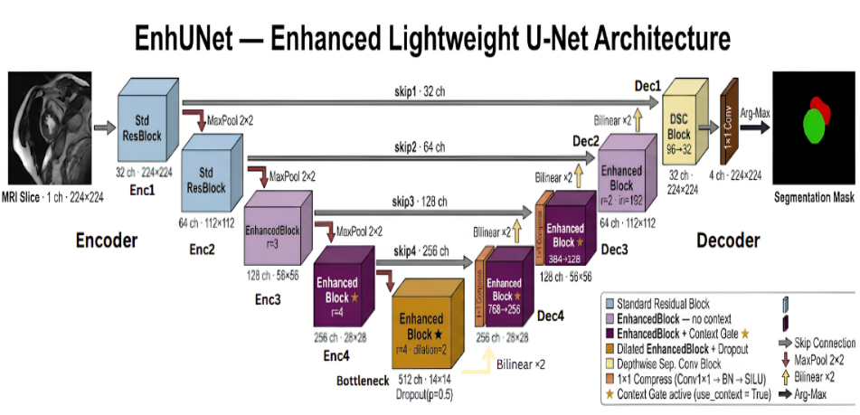
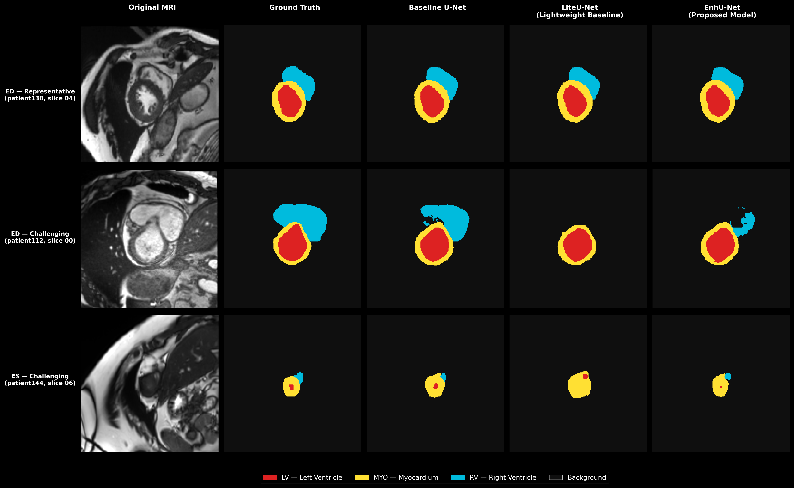

# EnhUNet: A Lightweight U-Net with Enhanced Convolutional Block Design for Cardiac MRI Segmentation
 


 
This repository contains the official implementation accompanying the Final Year Project 2 (FYP2) thesis:
 
> **EnhUNet: A Lightweight U-Net with Enhanced Convolutional Block Design for Addressing Representational Limitations in Cardiac MRI Segmentation**
> Rashadul Nafis Riyad (A22MJ3010)
> Supervised by **Ts. Dr. Liyana Adilla Binti Burhanuddin**
> Malaysia-Japan International Institute of Technology (MJIIT), Universiti Teknologi Malaysia (UTM)
 
---
 
## Overview
 
Cardiac magnetic resonance imaging (MRI) segmentation of the left ventricle (LV), right ventricle (RV), and myocardium (MYO) is essential for clinical diagnosis, but accurate deep learning models are often too large for deployment on resource-constrained clinical hardware. Lightweight U-Net variants built on depthwise separable convolution (DSC) solve the size problem, but they consistently lose segmentation accuracy.
 
This project identifies **three representational limitations** behind that accuracy loss:
 
1. **Linear-only channel mixing** in the standard DSC pointwise step
2. **Absence of global spatial context**, since depthwise filters only see a small local receptive field
3. **Insufficient channel space** before depthwise filtering, causing information collapse
To address all three at once, this project proposes **EnhUNet**, built around a novel **EnhancedBlock** that combines an inverted residual expansion (adapted from MobileNetV2), a non-linear channel MLP (adapted from ConvNeXt), and an SE-style global context gate, all inside a single residual block.
 
> **Novelty:** while individual fixes for these limitations exist in the broader deep learning literature, **no existing lightweight architecture for cardiac MRI segmentation resolves all three limitations together within a single convolutional block.** Prior cardiac MRI models address at most two at once. EnhancedBlock is the first design to unify all three in one block, specifically for this task.
 
## Key Contributions
 
- **Characterisation of three representational limitations** in DSC-based lightweight U-Nets, confirmed through controlled experiments on the ACDC dataset, and identification of a clear gap: **no prior lightweight architecture for cardiac MRI segmentation addresses all three within a single block.**
- **EnhancedBlock**, a unified residual module that closes this gap by resolving all three limitations together, something no existing cardiac MRI architecture does.
- **EnhUNet** recovers **84% of the accuracy gap** left by a lightweight baseline while using roughly **1/6th the parameters** of a full-capacity U-Net, and even surpasses it on myocardium boundary precision (HD95) and end-systole Dice.
- **Statistically validated** across 5 random seeds, **generalisation-tested** on the M&Ms dataset across 4 scanner vendors without retraining, and **deployed on an NVIDIA Jetson Orin Nano** to confirm real-time edge feasibility.
- **Interpretability analysis** using Seg-Grad-CAM and context-gate visualisation to support the architectural claims, not just report accuracy numbers.
## Architecture
 
**EnhancedBlock** — combines inverted residual expansion, a non-linear channel MLP, and a global context gate:
 

 
**EnhUNet** — the EnhancedBlock deployed across the encoder, bottleneck, and decoder of a lightweight U-Net:
 

 
The core architectural components in code are:
 
- **`EnhancedBlock`** (`src/models/lweunet/enhanced_block.py`) — the novel block combining inverted residual expansion, channel MLP, and `GlobalContextGate`
- **`LWEUNetV2`** (`src/models/lweunet/lweunet_v2.py`) — the full EnhUNet model
- **`LWEUNet`** (`src/models/lweunet/lweunet.py`) — the LiteU-Net baseline (lightweight, DSC-based)
- **`UNetBaseline`** (`src/models/unet_baseline.py`) — the full-capacity U-Net baseline
## Repository Structure
 
```
LWEU-NET/
├── configs/
│   ├── preprocessing_config.yaml       # ACDC preprocessing parameters
│   ├── preprocessing_config_mnms.yaml  # M&Ms preprocessing parameters
│   ├── train_unet_baseline.yaml        # Baseline U-Net training config
│   ├── train_lweunet_base.yaml         # LiteU-Net training config
│   ├── train_lweunet_v2.yaml           # EnhUNet training config (primary)
│   └── ...                             # Ablation and variant configs
├── figures/
│   └── xai/                            # Seg-Grad-CAM and context-gate figures
├── notebooks/
│   ├── 01_dataset_exploration.ipynb
│   └── 02_preprocessing_validatation.ipynb
├── results/
│   ├── figures/
│   │   └── figure5_6_final.png         # Qualitative comparison figure
│   └── statistical_runs/               # 5-seed validation results (JSON + txt)
├── scripts/
│   ├── run_preprocessing.py            # ACDC preprocessing entry point
│   ├── preprocess_mnms.py              # M&Ms preprocessing (no args needed)
│   ├── train.py                        # Model training
│   ├── train_resume.py                 # Resume interrupted training
│   ├── evaluate_phase.py               # ACDC test set evaluation (ED/ES/combined)
│   ├── evaluate_mnms.py                # M&Ms zero-shot generalisation evaluation
│   ├── aggregate_stats.py              # 5-seed statistical summary
│   ├── export_onnx.py                  # Export EnhUNet to ONNX for deployment
│   ├── xai_gradcam.py                  # Seg-Grad-CAM heatmaps
│   ├── xai_context_gate.py             # Context-gate weight visualisation
│   ├── xai_edge_map.py                 # Edge-map XAI analysis
│   ├── worst_rv_analysis.py            # Worst-case RV slice comparison
│   └── ...                             # Dataset verification and utility scripts
├── src/
│   ├── data/
│   │   ├── dataset.py                  # ACDCDataset (PyTorch Dataset)
│   │   └── augmentation.py             # Training and validation augmentation
│   ├── evaluation/
│   │   └── metrics.py                  # Dice, IoU, HD95, inference time
│   ├── losses/
│   │   └── combo_loss.py               # CombinedLoss (0.5×Dice + 0.5×CE)
│   ├── models/
│   │   ├── unet_baseline.py            # UNetBaseline
│   │   └── lweunet/
│   │       ├── enhanced_block.py       # EnhancedBlock, GlobalContextGate
│   │       ├── encoder.py / encoder_v2.py
│   │       ├── bottleneck.py / bottleneck_v2.py
│   │       ├── decoder.py / decoder_v2.py
│   │       ├── lweunet.py              # LWEUNet (LiteU-Net)
│   │       ├── lweunet_v2.py           # LWEUNetV2 (EnhUNet)
│   │       └── lweunet_v2_ablation.py  # Ablation model variants
│   ├── preprocessing/                  # Pipeline steps (resample, resize, normalise)
│   └── training/
│       └── trainer.py                  # Full training loop with early stopping
├── environment.yml                     # Conda environment (name: lweunet, Python 3.10)
├── requirements.txt                    # Pip dependencies
└── README.md
```
 
## Dataset
 
This project uses two public cardiac MRI datasets:
 
| Dataset | Purpose | Details |
|---|---|---|
| **ACDC** (Automated Cardiac Diagnosis Challenge) | Training, validation, and primary testing | 150 patients across 5 pathology groups (NOR, DCM, HCM, MINF, ARV). Official split: 100 patients for training, 50 held out for testing. Internal 80/20 train/validation split on the training set. |
| **M&Ms** (Multi-Centre, Multi-Vendor, Multi-Disease) | Zero-shot cross-vendor generalisation testing (no retraining) | Cardiac MRI from 4 different scanner vendors (Siemens, Philips, GE, Canon), used to test robustness to domain shift. |
 
Preprocessing includes phase extraction (ED/ES), 3D-to-2D slice conversion, spatial resampling to 1.5 mm/pixel, resizing to 224×224, percentile-based intensity normalisation, and data augmentation (rotation ±15°, flipping, scale ±10%, Gaussian noise, gamma correction).
 
### Expected data folder layout
 
```
data/
├── raw/
│   ├── training/          # ACDC raw training patients (patient001/ … patient100/)
│   └── testing/           # ACDC raw test patients   (patient101/ … patient150/)
├── preprocessed/
│   ├── train/             # patientXXX_ED_sliceYY_img.npy + _msk.npy
│   ├── val/
│   └── test/
├── splits/                # CSV files listing train/val patient IDs
└── MnM/
    ├── 211230_MnMs_Dataset_information_diagnosis_opendataset.csv
    ├── Testing/            # Official M&Ms test split (136 patients)
    └── preprocessed/       # A0S9V9_ED_sliceYY_img.npy + _msk.npy
```
 
## Installation
 
```bash
# Clone the repository
git clone https://github.com/RashadulRD786/lweu-net-cardiac-mri.git
cd lweu-net-cardiac-mri
 
# Create the conda environment (Python 3.10, PyTorch 2.1.2, CUDA 12.1)
conda env create -f environment.yml
conda activate lweunet
 
# Or install via pip
pip install -r requirements.txt
```
 
## Usage
 
### 1. Preprocess ACDC data
```bash
python scripts/run_preprocessing.py --config configs/preprocessing_config.yaml
```
 
### 2. Train a model
```bash
# Train EnhUNet (proposed model)
python scripts/train.py --config configs/train_lweunet_v2.yaml
 
# Train LiteU-Net (lightweight baseline)
python scripts/train.py --config configs/train_lweunet_base.yaml
 
# Train Baseline U-Net (full-capacity reference)
python scripts/train.py --config configs/train_unet_baseline.yaml
 
# Train with a specific seed (for 5-seed statistical validation)
python scripts/train.py --config configs/train_lweunet_v2.yaml --seed 42
```
 
### 3. Evaluate on the ACDC test set
```bash
python scripts/evaluate_phase.py \
    --config      configs/train_lweunet_v2.yaml \
    --checkpoint  checkpoints/lweunet_v2/best_model.pth \
    --phase       ALL
```
`--phase` accepts `ED`, `ES`, `combined`, or `ALL` (runs all three and prints a comparison table).
 
### 4. Zero-shot generalisation on M&Ms
```bash
# Step 1 — preprocess M&Ms test data (reads configs/preprocessing_config_mnms.yaml automatically)
python scripts/preprocess_mnms.py
 
# Step 2 — evaluate
python scripts/evaluate_mnms.py \
    --config          configs/train_lweunet_v2.yaml \
    --checkpoint      checkpoints/lweunet_v2/best_model.pth \
    --model_label     EnhUNet
```
 
### 5. Export to ONNX (for edge deployment)
```bash
python scripts/export_onnx.py
```
Saves `enhunet_v2.onnx`. The TensorRT engine was built on the Jetson using:
```bash
/usr/src/tensorrt/bin/trtexec \
    --onnx=enhunet_v2.onnx \
    --saveEngine=enhunet_v2.trt \
    --verbose
```
 
## Checkpoints / Pretrained Weights
 
Trained model weights are **not included** in this repository (too large for git). To reproduce results, train from scratch using the configs above with seed 42. The primary EnhUNet checkpoint is saved to `checkpoints/lweunet_v2/best_model.pth` after training.
 
## Results
 
### ACDC Test Set: Accuracy vs. Efficiency
 
| Model | LV Dice | RV Dice | MYO Dice | Mean Dice | HD95 (mm) | Params | GFLOPs | Inference |
|---|---|---|---|---|---|---|---|---|
| Baseline U-Net | 0.9368 | 0.8923 | 0.8661 | 0.8984 | 4.05 | 31.04M | 41.86G | 6.74 ms/slice |
| LiteU-Net | 0.9151 | 0.8529 | 0.8312 | 0.8664 | 6.60 | 1.15M | 2.57G | 3.49 ms/slice |
| **EnhUNet (ours)** | **0.9358** | 0.8815 | 0.8639 | **0.8937** | **4.21** | **5.19M** | 8.19G | 4.69 ms/slice |
 
EnhUNet recovers 84% of the accuracy gap left by LiteU-Net while using ~1/6th the parameters of the full-capacity Baseline U-Net. Statistical validation across 5 random seeds gave a mean Dice of **0.8914 ± 0.0020**, confirming the result is reproducible.
 

 
### Zero-Shot Generalisation (M&Ms, 4 scanner vendors, no retraining)
 
| Model | Overall LV | Overall RV | Overall MYO | Mean Dice | HD95 (mm) |
|---|---|---|---|---|---|
| Baseline U-Net | 0.8837 | 0.8309 | 0.7902 | 0.8350 | 3.28 |
| LiteU-Net | 0.8500 | 0.7244 | 0.7410 | 0.7718 | 6.40 |
| **EnhUNet (ours)** | **0.8663** | **0.7982** | **0.7654** | **0.8100** | 4.08 |
 
### Edge Deployment (NVIDIA Jetson Orin Nano)
 
| Platform | Configuration | Mean Dice | Mean HD95 (mm) | Inference Time |
|---|---|---|---|---|
| Workstation (RTX 5000) | PyTorch | 0.8937 | 4.21 | 4.69 ms/slice |
| Jetson Orin Nano | PyTorch CUDA | 0.8891 | 4.21 | 32.78 ms/slice |
| Jetson Orin Nano | TensorRT FP32 | — | — | **18.53 ms/slice** |
 
*Accuracy on the Jetson matches the workstation almost exactly (identical HD95), confirming segmentation quality is preserved on low-power edge hardware. TensorRT accuracy was not re-measured independently, since it uses the same FP32 weights and is expected to produce unchanged output.*
 
## Citation
 
If you find this work useful, please cite:
 
```bibtex
@misc{riyad2026enhunet,
  title        = {EnhUNet: A Lightweight U-Net with Enhanced Convolutional Block Design for Addressing Representational Limitations in Cardiac MRI Segmentation},
  author       = {Riyad, Rashadul Nafis},
  year         = {2026},
  howpublished = {Thesis, Malaysia-Japan International Institute of Technology (MJIIT), Universiti Teknologi Malaysia},
  note         = {Supervised by Ts. Dr. Liyana Adilla Binti Burhanuddin}
}
```
 
## Acknowledgements
 
- **Ts. Dr. Liyana Adilla Binti Burhanuddin**, for her guidance and supervision throughout this research.
- **Malaysia-Japan International Institute of Technology (MJIIT), Universiti Teknologi Malaysia (UTM)**, for the academic environment and resources supporting this work.
- The creators and maintainers of the **ACDC** and **M&Ms** datasets, whose publicly available data made the experimental evaluation and generalisation analysis possible.
## Contact
 
For questions, feedback, or collaboration inquiries, please open an issue on this repository or reach out via email at **nafisrashadul@gmail.com**.
 